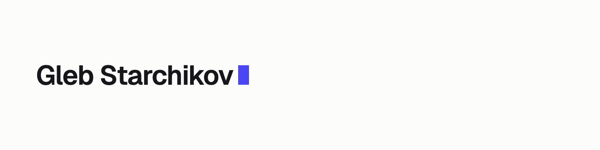

<picture>
  <source media="(prefers-color-scheme: dark)" srcset="./header-dark.png">
  
</picture>

Founder and solo builder. I design and ship AI-powered apps, developer tools, and the systems that hold them together, end to end, mostly alone.

Everything shares one lane: near-monochrome, type-led, keyboard-first. Restraint over decoration.

### Selected work

- **[design](https://github.com/glebstarchikov/design)**: the unified design system behind everything I ship
- **[Launchpad](https://github.com/glebstarchikov/Launchpad)**: self-hosted founder command center · Bun · Hono · React · SQLite
- **[rusty-noter](https://github.com/glebstarchikov/rusty-noter)**: native macOS notes with a local markdown vault, agent-native
- **[claude-widget](https://github.com/glebstarchikov/claude-widget)**: the Claude Code critter, living in your Mac menu bar
- **[good-eye](https://github.com/glebstarchikov/good-eye)**: a searchable design-inspiration database for Claude, via MCP
- **[rag-workshop](https://github.com/glebstarchikov/rag-workshop)**: a notebook that teaches RAG to non-technical people

### Elsewhere

- [glebstarchikov.nl](https://glebstarchikov.nl)
- glebstar06@gmail.com
